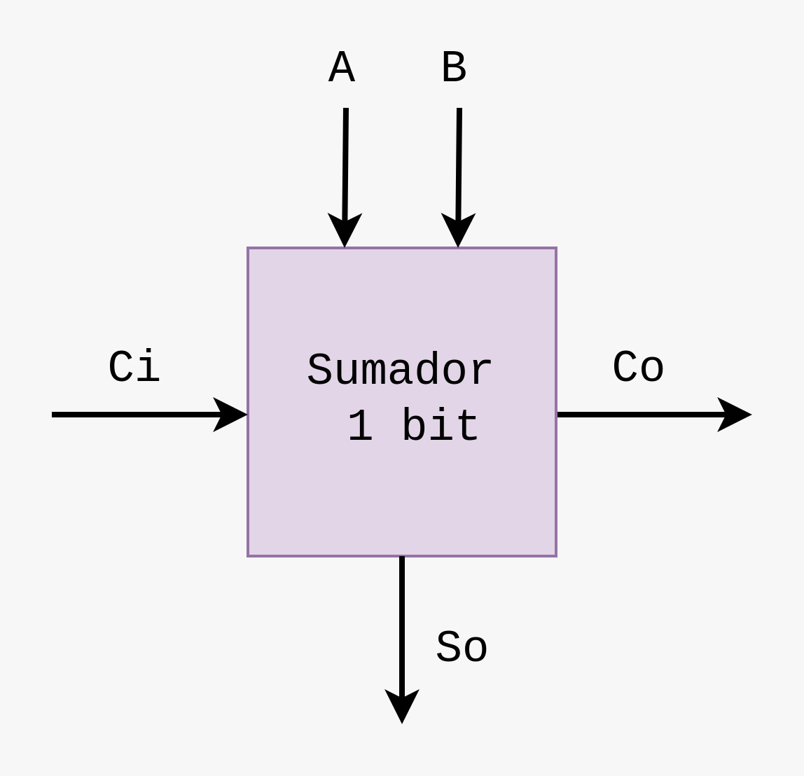
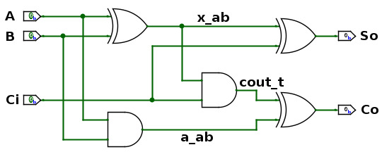

## Sumador de 1 bit

En diseño digital, un sumador de 1 bit es un circuito combinacional que realiza la suma de dos bits junto con un bit de acarreo de entrada. Es uno de los bloques fundamentales en la construcción de sumadores de mayor tamaño, que son esenciales en operaciones aritméticas dentro de procesadores y sistemas digitales. También se conoce como sumador completo.

El sumador de 1 bit toma tres entradas: los dos bits que se desean sumar (```A``` y ```B```) y un bit de acarreo de entrada (```Ci```) que puede provenir de una posición menos significativa en un sumador más grande. El circuito produce dos salidas: el bit de suma (```So```) y el bit de acarreo de salida (```Co```). A continuación se muestra su respectivo bloque funcional:


<p align="center">
 
</p>


A continuación se presenta la tabla de verdad del sumador completo de 1 bit.

<p align="center">

|   A  |   B  |  Ci |   Co  |   So  |
|------|------|-----|-------|-------|
|   0  |   0  |  0  | **0** | **0** |
|   0  |   0  |  1  | **0** | **1** |
|   0  |   1  |  0  | **0** | **1** |
|   0  |   1  |  1  | **1** | **0** | 
|   1  |   0  |  0  | **0** | **1** |
|   1  |   0  |  1  | **1** | **0** |
|   1  |   1  |  0  | **1** | **0** |
|   1  |   1  |  1  | **1** | **1** | 
</p>

A partir de la tabla de verdad, mediante **mapas de Karnaugh**, se obtienen las expresiones que definen el sumador de 1 bit, las cuales son:

<p align="center">

</p>


<p align="center">

</p>

<p align="center">
 
</p>

### Implementación en HDL


#### Lógica combinacional:

Es impotante recordar que la lógica combinacional es un tipo de circuito lógico donde las salidas en cualquier instante de tiempo dependen únicamente de las combinaciones actuales de las entradas, sin depender de estados anteriores o memorias internas.

#### 1. Implementación estructural (empleando primitivas):

En el archivo [sum1b_primitive.v](./src/sum1b_primitive.v) encontrarán la representación explícita del funcionamiento de un sumador de 1 bit utilizando puertas lógicas primitivas, como se explicó anteriormente, que es ideal para entender cómo se construyen operaciones aritméticas básicas a nivel de *hardware*.

En el contexto de Verilog y diseño digital, las primitivas se refieren a las puertas lógicas básicas y otros elementos fundamentales que se utilizan para construir circuitos lógicos. Estas primitivas son bloques de construcción básicos que se pueden utilizar para diseñar circuitos más complejos. Verilog incluye primitivas predefinidas que permiten describir el comportamiento del *hardware* de manera simple y directa.

  * **Características de las primitivas:**

    * **Básicas:** Son los bloques de construcción más elementales en el diseño de circuitos lógicos.

    * **Predefinidas:** En Verilog, estas primitivas están predefinidas y listas para ser utilizadas sin necesidad de definirlas manualmente.

    * **Directas:** Facilitan la implementación de funciones lógicas simples, como sumar bits, realizar operaciones de control, etc.
  
    * **Eficientes:** Su uso es eficiente en términos de síntesis, ya que se mapean directamente a los recursos de *hardware* básicos.

 En la descripción HDL [sum1b_primitive.v](./src/sum1b_primitive.v), la lógica combinacional se emplea para calcular la suma (```So```) y el acarreo de salida (```Co```) a partir de las entradas (```A```, ```B```, y ```Ci```), empleando operaciones lógicas básicas como ```AND```, ```OR``` y ```XOR```.

#### 2. Implementación comportamental:

El módulo [sum1b.v](./src/sum1b.v) implementa un sumador de 1 bit utilizando un enfoque diferente al del módulo [sum1b_primitive.v](./src/sum1b_primitive.v). En esta implementación, se emplean registros y asignaciones en un bloque ```always``` para calcular la suma y el acarreo.

* Registros y asignaciones:

    * ```reg [1:0] result;```: Se utiliza un registro de 2 bits para almacenar el resultado de la operación de suma y el acarreo. Este registro tiene dos bits: el primero para la suma (```result[0]```) y el segundo para el acarreo (```result[1]```).

* Cálculo de resultados:

    * ```always @(*)```: Este bloque ```always``` se ejecuta cada vez que cambian las entradas (```A```, ```B```, o ```Ci```). Dentro de este bloque, se realiza la operación de suma ```A + B + Ci```, que se almacena en el registro ```result```.

      El bloque ```always @(*)``` es igual a ```always @ (A or B or Ci)```, y representa que lo que se defina en el interior, en este caso el cálculo de ```result```, es inmediato y basado únicamente en las entradas actuales, es decir, la operación se ejecuta cada vez que haya un cambio en alguna de las entradas.

    * ```result = A + B + Ci;```: La suma de ```A```, ```B```, y ```Ci``` se calcula y se almacena en ```result```. Dado que result es un registro de 2 bits, puede almacenar tanto la suma como el acarreo de salida.

* Asignaciones de salidas:

    * ```assign So = result[0];```: Se asigna el bit de suma (```result[0]```) a la salida ```So```.

    * ```assign Cout = result[1];```: Se asigna el bit de acarreo (```result[1]```) a la salida ```Co```.


### Comparación:

La implementación del [sum1b.v](./src/sum1b.v) es una implementación basada en comportamiento o implementación de alto nivel, en donde se utiliza un enfoque más abstracto para describir el comportamiento del circuito en lugar de utilizar puertas lógicas primitivas. Este tipo de implementación se enfoca en especificar qué se debe hacer, más que en cómo se hace a nivel de *hardware*. Este enfoque simplifica la descripción del comportamiento del sumador al evitar el detalle de las puertas lógicas primitivas, facilitando así la comprensión y la mantenibilidad del código.

Ahora bien, la implementación de cualquier diseño digital empleando primitivas tiene la ventaja de facilitar la **optimización de recursos** y, por ende, la **eficiencia** **en** **el** *hardware*, ya que las herramientas de síntesis pueden optimizar el uso de recursos físicos del hardware (como LUTs y *Gates*) cuando se emplean primitivas, lo que puede llevar a una implementación más eficiente.


## Entregables

1. Comprenda cada línea del código HDL de cada archivo que se encuentra en la carpera [src](./src) y comente si es necesario en su respectivo archivo ```README.md```.

2. Realice la respectiva simulación de las dos descripción HDL ([sum1b_primitive.v](./src/sum1b_primitive.v) y [sum1b.v](./src/sum1b.v)) y muestre evidencias en su respectivo archivo ```README.md```, corroborando que se cumple la tabla de verdad descrita anteriormente. Para ello puede emplear el *testbench* adjunto ([testbench](./src/sum1b_tb.v)) o, empleando el simulador que haya configurado por defecto en la instalación de ```IDE Quartus```, puede forzar los valores de las entradas en un instante de tiempo determinado.

3. Cargue la descripción HDL en la tarjeta de desarrollo, empleando la ```IDE Quartus``` y muestre en el laboratorio el funcionamiento del sumador de 1 bit, empleando interruptores como las entradas y LEDs como las salidas. 

4. Para que visualice lo expuesto en la sección **Comparación**, en la ```IDE Quartus```, luego de *sintetizar* cada una de las descripciones HDL, vaya al menú ```Tools```, seleccione la opción ```Netlist viewer``` y luego la opción ```RTL viewer```. Compare ambos diagramas y muestre las respectivas evidencias en el archivo ```README.md```.

## Referencias

**[1]**  Beltrán, F., Repositorio de Github ECCI-ARQUITECTURA DE PROCESADORES 2024-2 [Online:] https://github.com/ELINGAP-7545/page.