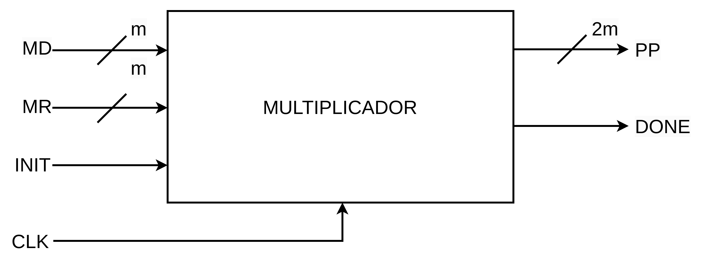
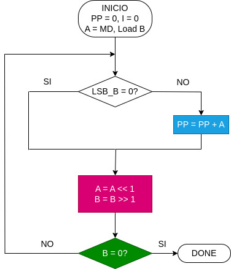
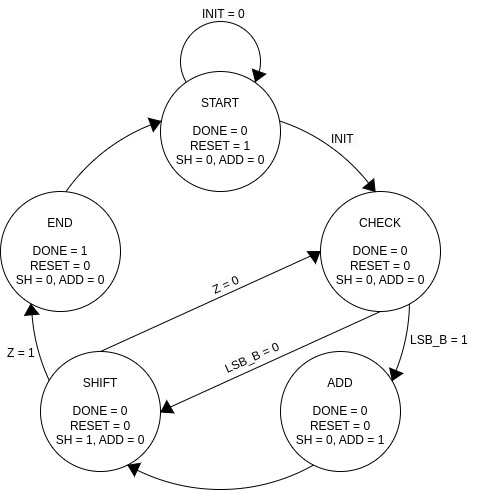

## Multiplicador de 3 bits


La descripción HDL que encontrarán implementa un multiplicador secuencial de 3 bits utilizando una máquina de estados finita (FSM) para controlar el proceso de multiplicación basado en el algoritmo de productor parciales. En la siguiente figura se muestra el bloque funcional del multiplicador.

 <p align="center">
 
</p>


### Funcionamiento


El módulo multiplicador realiza la multiplicación de dos números de 3 bits cada uno (```MR``` y ```MD```) de forma **secuencial**, donde los productos parciales se suman y desplazan a lo largo de varios ciclos de reloj. El resultado final se almacena en ```pp``` (producto parcial de 6 bits) y la señal ```done``` indica que la multiplicación finalizó.

 La multiplicación secuencial implica que el módulo procesa los bits de los operandos uno a uno, acumulando los productos parciales y desplazándolos hasta obtener el resultado final. Cada ciclo de reloj corresponde a una operación específica, como sumar un producto parcial o desplazar los registros involucrados.

 A continuación podrán encontrar el diagrama de flujo del multiplicador:

 <p align="center">
 
</p>

### Máquina de estados

 <p align="center">
 
</p>


### Lógica secuencial

La lógica secuencial en el multiplicador se evidencia por el uso de registros y ciclos de reloj para controlar el proceso de multiplicación a lo largo del tiempo. A diferencia de la lógica combinacional, que evalúa las salidas inmediatamente en función de las entradas actuales, la lógica secuencial depende del estado anterior, y el sistema avanza a través de varios estados en función de una señal de reloj.


## Entregables

1. Comprenda cada línea del código HDL de cada archivo que se encuentra en la carpera [src](./src) y comente si es necesario en su respectivo archivo ```README.md```.

2. Realice la respectiva simulación de la descripción HDL del multiplicador de 3 bits y muestre evidencias en su respectivo archivo ```README.md```. Para ello puede emplear el *testbench* adjunto ([testbench](./src/sum4b_tb.v)) o, empleando el simulador que haya configurado por defecto en la instalación de ```IDE Quartus```, puede forzar los valores de las entradas en un instante de tiempo determinado.

3. Cargue la descripción HDL en la tarjeta de desarrollo, empleando la ```IDE Quartus``` y muestre en el laboratorio el funcionamiento del sumador de 4 bits, empleando interruptores como las entradas y LEDs como las salidas. 


<!-- 
## Registros y Señales Internas

* Registros:
    * ```sh```: Controla si los registros A y B se desplazan.
        
    * ```rst```: Resetea los registros A y B.
        
    * ```add```: Controla si se suma el producto parcial al acumulador pp.
        
    * ```A```: Registro de 6 bits para almacenar el multiplicador desplazado.
        
    * ```B```: Registro de 3 bits para almacenar el multiplicando desplazado.
        
    * ```status```: Almacena el estado actual de la FSM.
   
* Señal interna:
        
    * ```z```: Indicador de que B ha llegado a 0, lo que señala el fin de la multiplicación.

### Máquina de Estados Finita

La FSM tiene cinco estados:

* ```START```: Inicializa las señales y espera que ```init``` sea activa para comenzar la multiplicación.

* ```CHECK```: Verifica el bit menos significativo de ```B```. Si es 1, procede  a la suma (estado ```ADD```), si no, pasa directamente al desplazamiento (estado ```SHIFT```).

* ```ADD```: Suma el valor de A al producto parcial pp si el bit menos significativo de ```B``` es *1*.

* ```SHIFT```: Desplaza ```A``` y ```B``` para procesar el siguiente bit del multiplicando. Si ```B``` ha alcanzado *0* (```z``` *== 1*), la FSM pasa al estado ```END1```.

* ```END1```: Señala que la multiplicación ha terminado, activando ```done```, y vuelve al estado ```START```.

### Funcionamiento

* **Inicialización**: Cuando init es activa, la FSM se mueve de ```START``` a ```CHECK```, iniciando la multiplicación.

* **Suma condicional**: Si el bit menos significativo de ```B``` es 1, se añade ```A``` al acumulador ```pp```.

* **Desplazamiento**: Después de la suma (o si el bit es 0), los registros ```A``` y ```B``` se desplazan.

* **Finalización**: Cuando ```B``` llega a 0, la FSM indica que la multiplicación ha finalizado y mantiene el resultado en ```pp```. -->