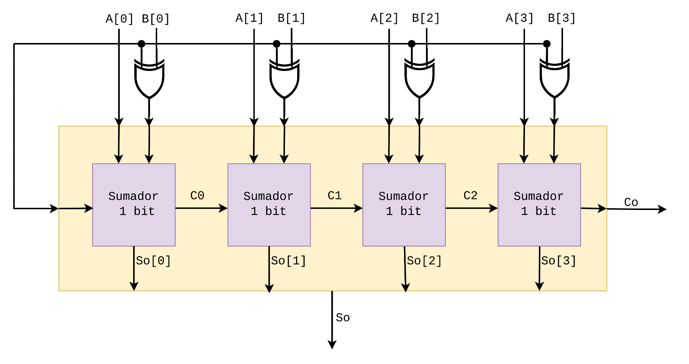

## Restador  de 4 bits

El objetivo de este proyecto es implementar un restador de 4 bits basado en la técnica de complemento a 2, permitiendo realizar operaciones de resta $A−B$ utilizando el módulo del sumador de 4 bits, construido en el segundo laboratorio, y compuertas lógicas ```XOR```. 


#### Operación complemento a 2.

El complemento a 2 permite representar tanto números positivos como negativos en un sistema binario. Un número negativo, en complemento a 2, es el complemento binario de su valor absoluto menos uno. Esto simplifica las operaciones de suma y resta, pues los circuitos sumadores pueden usarse sin modificaciones significativas para manejar números negativos. Los módulos de resta  utilizan sumadores y simplemente convierten uno de los operandos a su complemento a 2 para realizar la operación de resta como una suma. El complemento a 2 se cálcula como sigue:   

##### Paso 1: Inversión de Bits

Invertir todos los bits del número. Por ejemplo, si el número binario es $1101_2$​, su inversión de bits será $0010_2$​.


##### Paso 2: Paso 1 + 1:

Se suma 1 al número binario invertido. Continuando con el ejemplo anterior, $0010_2+1 = 0011_2$​.


El resultado final, $0011_2$​, es el complemento a 2 de $1101_2$​, que representa el número $−3$ en décimal.


### Funcionamiento del restador

El circuito presentado a continuación tiene la capacidad de realizar restas utilizando una técnica de complemento a 2. 

<p align="center">
 
</p>

Para realizar la operación de resta, el circuito presenta el siguiente comportamiento: 

1. **Complemento a 1**: Al fijar la entrada ```Sel = 1```, las compuertas ```XOR``` invierten los bits de ```B``` (el sustraendo de la operación) obteniendo así el complemento a 1 de la entrada ```B```. 

2. **Complemento a 2**: Cuando ```Sel = 1```, también sucede que el acarreo de entrada del primer sumador de 1 bit es 1, lo que conlleva a que se sume el complemento a 1  de ```B```en su con 1 lo que representa el complemento a 2.

3. **Resultado final**: El circuito adicionalmente suma ```A``` (el minuendo de la operación) con el complemento a 2 de ```B```, obtenido en el paso anterior, representando la operación  $A−B$. Al igual que en la suma, el acarreo de salida se propaga de un bloque a otro.

Cuando la entrada ```Sel = 0``` la salida de las compuertas ```XOR``` es simplemente la misma entrada ```B```, por lo tanto se ejecuta la operación de suma $A+B$.

### Representación de números negativos

Si el resultado de la resta es menor que 0, es necesario realizar complemento a 2 a este resultado para poderlo representar adecuadamente. 

Cuando ```Co``` es 0, esto representa que el resultado de la operación es negativo. 

