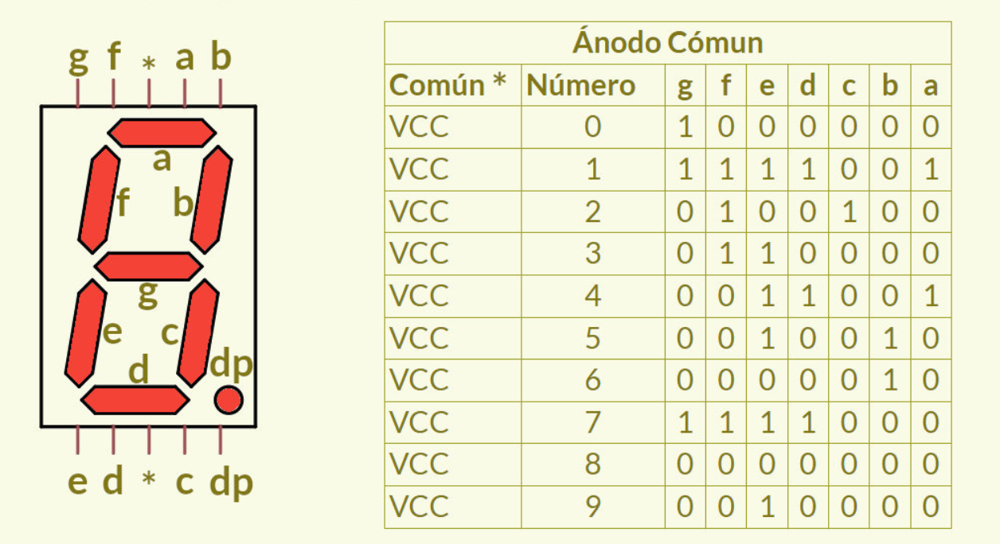
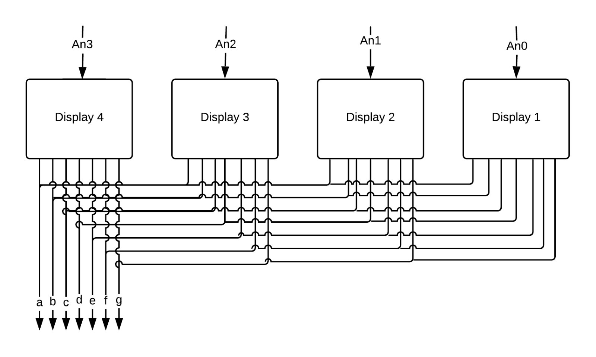

## Implementación de 7 segmentos.

El objetivo de este laboratorio es visualizar el resultado de un sumador de 4 bits en los display 7 segmentos que vienen en la tarjeta de desarrollo.

### Display de 7 segmentos:

Este tipo de *display* consta de siete segmentos dispuestos en forma de "$8$" estos segmentos son LEDs y una combinación particular de éstos permite representar un dígito décimal o hexadécimal. Al iluminar dichas combinaciones específicas de segmentos, se puede representar dígitos del $0$ al $9$ en representación décimal o del $0$ a $F$ en hexadécimal. Lo anterior se puede ver de forma gráfica en las imágenes de la siguiente sección.

### Primera parte: Diseño BCD-7seg

Realizar el diseño, sintentización e implementación del *display* de 7 segmentos, que permita visualizar números en representación hexadécimal en uno de los *displays*. En el siguiente gráfico, se observa el funcionamiento deseado del display:

 

Imagen tomada de [User:Guam + Various](https://commons.wikimedia.org/wiki/File:Seven_segment_display-animated.gif)

En la siguiente figura se muestran cómo se distribuyen los 7 segmentos en el *display* cuando se tiene una configuración de ánodo común:

 

 

### Segunda parte: Visualización Dinámica 4 *Displays* de 7 Segmentos

En muchas aplicaciones se requiere más de un *display* de 7 segmentos, por lo que es necesario generar una visualización tal que sea necesario el menor número de pines para conectar todos los display con la tarjeta de desarrollo.

En la parte 1 se visualizaba el número en un sólo *display* de 7 segmentos. Pero en la mayoría de los casos, los 7 pines de los ánodos están interconectados entre cada *display*, como se observa en la figura:

 

